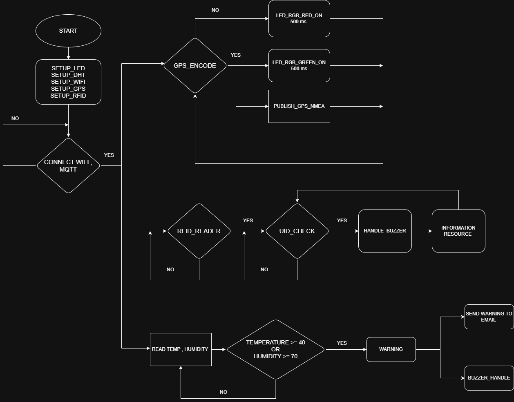
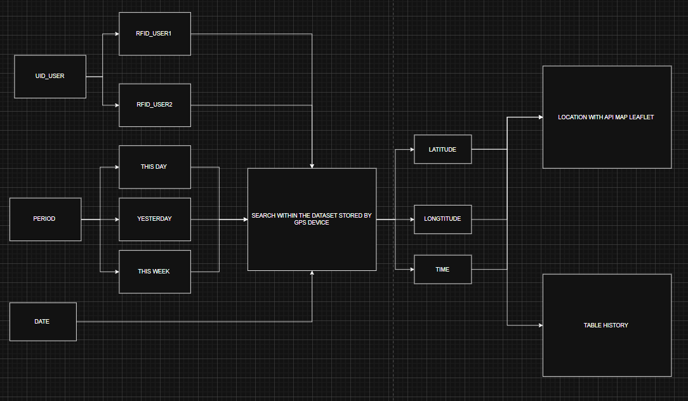
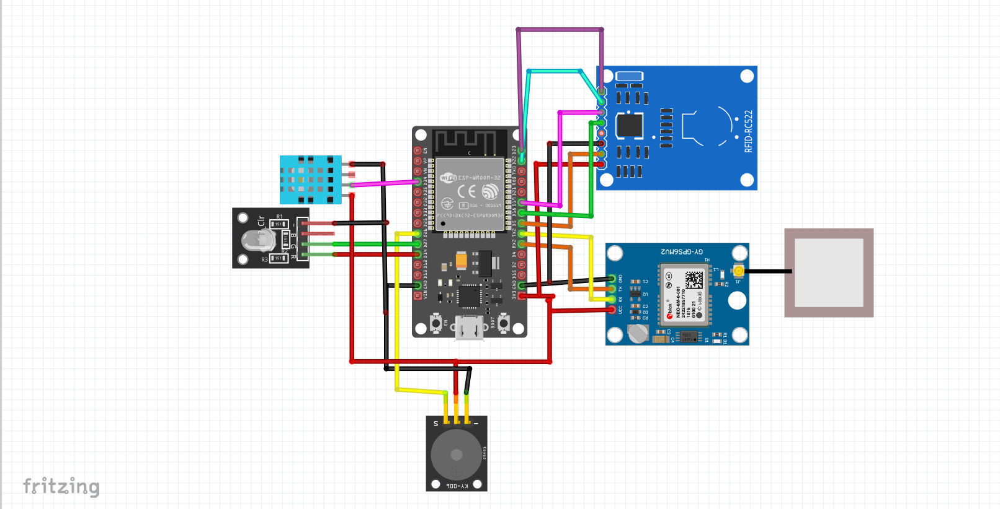

# 1. Bài toán thực tế

## 1.1 Nhu cầu thực tiễn

Sự phát triển mạnh mẽ của các dịch vụ vận chuyển công nghệ như **Grab, Gojek, Be** đã cho thấy nhu cầu cấp thiết về một hệ thống **quản lý đội xe và tài xế từ xa**. Khi số lượng xe và tài xế hoạt động liên tục ngoài đường, việc theo dõi bằng phương pháp thủ công trở nên kém hiệu quả và tồn tại nhiều hạn chế:

- Khó kiểm soát **vị trí xe theo thời gian thực**
- Không theo dõi được **tốc độ và hành vi lái xe**
- Không nắm được **danh tính tài xế** mỗi khi nhận xe
- Không giám sát được **nhiệt độ – độ ẩm cabin**, tiềm ẩn nguy cơ hỏng hóc thiết bị hoặc ảnh hưởng sức khỏe tài xế
- Tốn nhiều **nhân lực giám sát**, dễ sai sót trong quản lý

Những vấn đề trên ảnh hưởng trực tiếp đến:

- **An toàn của tài xế và phương tiện**
- **Chất lượng dịch vụ vận chuyển**
- **Hiệu quả điều phối xe trong giờ cao điểm**
- **Chi phí vận hành của doanh nghiệp**

### 1.2 Ý tưởng và động lực thực hiện
Việc xây dựng một **hệ thống IoT giám sát đội xe** sử dụng **ESP32** kết hợp với các công nghệ:

- **GPS** để lấy vị trí và tốc độ
- **RFID** để nhận dạng tài xế đăng nhập
- **Cảm biến DHT** để theo dõi nhiệt độ – độ ẩm cabin
- **MQTT** để truyền dữ liệu real-time lên server / dashboard

là hoàn toàn cần thiết và mang tính ứng dụng cao.

Hệ thống này giúp các doanh nghiệp vận tải, dịch vụ xe công nghệ hoặc đơn vị logistics có thể xây dựng một nền tảng:

- **Giá rẻ**
- **Linh hoạt**
- **Dễ mở rộng**
- **Tự do tùy biến theo nhu cầu thực tế**
# 2. Nội dung chính
## 2.1 Phần cứng 
- **Vi điều khiển** 
    - ESP32 DEVKIT V1 
- **Định vị và theo dõi**
    - 1 x GPS NEO-6M 
- **Nhân dạng tài xế**
    - 1 x RFID MFRC522 
- **Giám sát môi trường cabin**
    - 1 x DHT11 
- **Cảnh báo**
    - 1 x Buzzer 
- **Đèn trạng thái**
    - 1 x LED RGB
### 2.2 Phần mềm
**Node-RED Dashboard**
- **Hiển thị vị trí xe trên bản đồ (Leaflet/OSM)** 
- **Trạng thái GPS: tốc độ, HDOP, số vệ tinh**
- **Thông tin tài xế đang đăng nhập**
- **Dữ liệu cảm biến cabin**
- **Lịch sử hành trình (GPS history)**
- **Trạng thái kết nối MQTT , WIFI**
**MQTT Broker**
- **EMQX/HiveMQ**
**Phần mềm phát triển**
- **Platform-IO**

# 3. Sơ đồ khối
## 1. Sơ đồ khối chung 

## 2. Lưu đồ thuật toán 
### 2.1 Lưu đồ thuật toán chung 

### 2.2 Tìm kiếm lịch sử di chuyển 

## 3. Sơ đồ kết nối 

| Function / Module | Macro Name   | ESP32 Pin | Description                             |
| ----------------- | ------------ | --------- | --------------------------------------- |
| DHT11 Sensor      | `DHTPIN`     | 15        | Data pin của cảm biến nhiệt độ và độ ẩm |
| DHT11 Type        | `DHTTYPE`    | DHT11     | Định nghĩa loại cảm biến                |
| GPS Module (RX)   | `GPS_RX_PIN` | 16        | ESP32 nhận dữ liệu GPS                  |
| GPS Module (TX)   | `GPS_TX_PIN` | 17        | ESP32 truyền dữ liệu (nếu dùng)         |
| LED Red           | `LED_RED`    | 22        | LED báo lỗi hoặc cảnh báo               |
| LED Green         | `LED_GREEN`  | 23        | LED báo trạng thái hoạt động            |
| Buzzer            | `BUZZER`     | 26        | Còi báo động                            |
| RFID SS           | `RFID_SS`    | 13        | Chân SS của module RC522                |
| RFID RST          | `RFID_RST`   | 21        | Chân Reset của RC522                    |
| RFID SCK          | `RFID_SCK`   | 12        | SPI Clock                               |
| RFID MOSI         | `RFID_MOSI`  | 14        | SPI MOSI                                |
| RFID MISO         | `RFID_MISO`  | 27        | SPI MISO                                |

